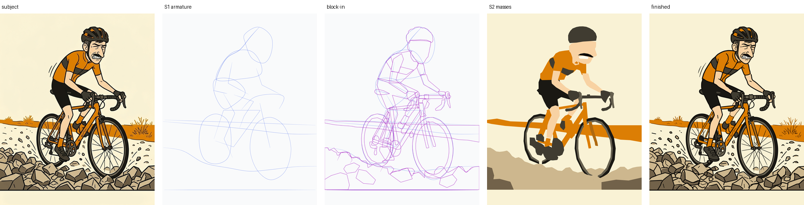
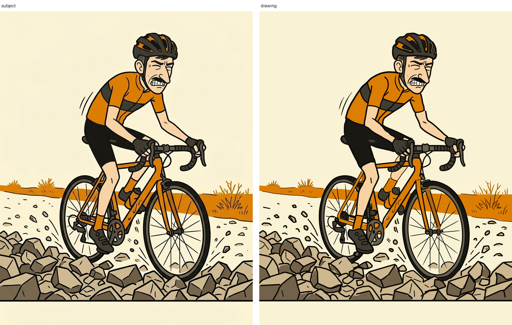
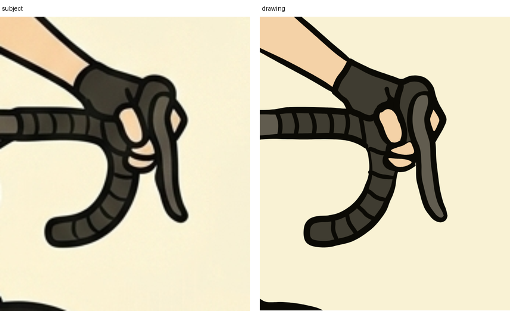

# drawing

A Claude Code skill for drawing a subject by hand. An agent using it places
every mark itself — reads the subject in writing, blocks it in with straights
it can measure, gates each stage on a render it has to look at, and only then
commits to curve, ink and black. Tools only measure the subject and render
what was placed; they never generate a mark. A blind describer — a process
shown the render alone, with no script and no subject — judges what the
picture shows, and that judgement is the gate on every stage's event. No
image model is involved at any point.

## Gallery



One panel through the ladder — subject, armature, block-in, masses, finished.



A scene drawn one drawer per part — head, body, cockpit, bicycle, wheels, rocks — then merged and finished by one more.



A part — hand on the brake hood — drawn and judged at 4x, never at panel scale.

## How it works

### The object ladder

Eleven stages, each narrowing one freedom while the next is still cheap to
fix. A stage may not begin until the previous gate is true on a render that
was actually looked at.

```
0  READ            gate: a shape sentence per part; the acceptance list
   |                       quotes the describer's own answers
   v  palette.json regions.json parts.json reading.md
1  GESTURE         gate: describe.sh gesture.png answers the event the
   |                       way subject.describe.md does
   v  3-10 loose strokes: line of action, each mass as one loop
2-3 BLOCK-IN        gate: check.py --overlay -- the straights sit on
   |                       the subject's own edges
   v  one region per tier-1/2 part, smooth=False, junctions shared by name
4  CONSTRUCTION     gate: a written turn for every tier-1 volume
   |
   v  volumes turned, centre lines placed
5  MASSES           gate: check.py --masses -- same shape, said in words
   |
   v  one flat per surface, trapped past where the ink will go
6  CONTOUR          gate: check.py --overlay, again, on the curve
   |
   v  the real edge, curved where the subject curves
7-8 INK             gate: check.py --doubled and --ladder both pass
   |                       (stages 5-8 interleave per form, far to near)
   v  one stroke per edge, width measured, tagged by the edge it states
9  FILL             gate: rendered with --hide ink, figure still
   |                       separates from ground
   v  flats refined, blacks massed as one value
10 CORRECT          gate: describe.sh drawing.png matches the acceptance
                            list; --registration --parts --ranking
```

### The scene ladder

The object ladder, wrapped. S0-S2 design the picture and draw no object.
Then either one drawer runs every part through the object ladder in place,
or the work is split: one S0-S2 drawer designs the whole panel, one drawer
per part runs that part's own object ladder in a private copy of the
directory, and a final drawer merges the copies and finishes the panel.

```
S0  read as a tone field   one drawer: centre of interest, tone plan,
S1  armature                the welded shapes (5-12, no closed contour),
S2  masses / welding        every part vs. welded, the interfaces table
        |
        |  split.md: one drawer per part, depth order, each editing only
        |  its own "# === part: NAME ===" section of draw.py, in a copy
        v
  +-----------+   +-----------+   +-----------+
  |  part A   |   |  part B   |   |  part C   |   S3: object ladder stages
  |  own copy |   |  own copy |   |  own copy |   2-10, each part's own
  |  stages   |   |  stages   |   |  stages   |   correction rounds,
  |  2 .. 10  |   |  2 .. 10  |   |  2 .. 10  |   --zoom before leaving it
  +-----------+   +-----------+   +-----------+
        |               |               |
        +-------+-------+-------+-------+
                v
          MERGE: draw.py section by section, parts.json entry by entry
                v
S4  junctions              one final drawer, on the merged panel:
S5  emphasis gradient       walk the interfaces table, confirm the
S6  interfaces               emphasis decay, spot the blacks, vignette,
S7  blacks / texture         --doubled and --depth clean, no part
S8  correct from a distance   misnamed on its own crop
```

### Data flow

```
source image --4x BILINEAR-->  subject.png (working) + subject_1x.png
     |
     |  trace.py / crop.py      measuring only -- never a mark
     v
palette.json  regions.json  meas/NAME.json
     |
     |  you read positions off these, type the points you decide carry
     |  the shape
     v
draw.py  --pen.py: stroke(), frame(), write()-->  ops.json
     |
     |  harness/cli.mjs: tldraw, driven headless by Playwright
     v
gesture.png  blockin.png  contour.png  drawing.png
     |
     +--> check.py --masses --overlay --zoom --doubled --depth ...
     +--> describe.sh drawing.png                (blind judge)
     |
     v
corrections, named by stage  -->  back into draw.py (stage="correct")
```

### The authorship rule

Tools measure; only `draw.py` draws. A measuring tool may report where things
are — a landmark, a width, the rows a slot occupies, a traced contour to read
positions off — but it may not emit the point list, and nothing may turn a
trace into strokes on your behalf: no generated section module, no loop over
regions, no generator whose output is imported or pasted into `draw.py`.

`pen.write` refuses to save the drawing, and `check.py --ladder` fails it, on:

- ink with no gesture, block-in and contour stage behind it (the stages must
  exist; neither checks that every ink mark has a contour under it)
- a stroke called from outside `draw.py`, or a call site reached more than
  once — a loop, a comprehension, an import that draws
- control points that are mostly not written as literal numbers in `draw.py`

Reading a traced outline and typing the points where the silhouette turns,
in perimeter order, is drawing. Emitting that same walk automatically, one
point per row, is not. Generated output pasted into `draw.py` as literal
numbers passes both checks and is still forbidden: the rule, not a tool,
draws that line.

## The checks

`check.py` gates a render; each flag is a worklist, never a score.

| group | flag | catches |
|---|---|---|
| shape/placement | `--masses` | the wrong shape at thumbnail size — a design gate, not a proportion gate |
| | `--scan x,y,w,h --side S` | a coordinate or a proportion off by row, subject beside drawing |
| | `--overlay [--box]` | the two inks blended together; the only view of interior lines |
| | `--zoom x,y,w,h` | whether the marks are any good at 4x — the primary gate on any object |
| | `--weights rows` | the line hierarchy against the subject's, as width@centre |
| | `--registration` | colour and line disagreeing |
| | `--unfilled --paper C` | bare paper where the subject carries the object, and a flat painted where the subject is bare |
| | `--faces ops.json --regions R` | a flat simpler than the traced region under it |
| depth/order | `--doubled ops.json` | one edge stated twice on the page |
| | `--depth ops.json parts.json` | write order that does not deliver the inventory's `in_front`; UNRESOLVED where tags and inventory disagree |
| counts/inventory | `--parts parts.json` | a part absent, or drifted out of its box |
| | `--checklist parts.json` | a sub-form a reference's checklist names, missing with no `_absent` reason — blocks `build.sh` |
| | `--census parts.json` | a repeated form culled, merged or added against the subject's own count |
| | `--ranking parts.json` | a part outranking its tier, or two forms welded into one value |
| authorship | `--ladder ops.json` | a stage that does not exist, or a mark the script did not write |

## Install

As a Claude Code plugin:

```
/plugin marketplace add jchapuis/drawing-skill
/plugin install drawing@drawing-skill
```

Or clone it straight into the skills directory:

```bash
git clone https://github.com/jchapuis/drawing-skill ~/.claude/skills/drawing
```

Then, once, the rendering harness:

```bash
cd ~/.claude/skills/drawing/harness && npm install && npm run build && npx playwright install chromium
```

Python needs `numpy`, `scipy`, `pillow` and `opencv-python`. `describe.sh`
needs the `claude` CLI on PATH. A drawing lives in its own directory holding
`subject.png`; copy `build.sh` in beside it and point it at the skill with
`export SKILL=~/.claude/skills/drawing` (or edit the `SKILL=` line directly)
— a copied `build.sh` cannot find the skill on its own, and says so.

## Cost

This buys fidelity, not speed. A single part carried through the full ladder
runs roughly 0.35-0.45M tokens. A scene split one drawer per part runs
roughly 3M tokens across about eight drawers. Budget accordingly — a scene
with many recognisable parts is expensive by construction, not by accident.

## Extension points

- **A new subject class** — add `reference/<topic>.md` and load it from
  `SKILL.md`'s Reference section where relevant. Give it a fenced code
  block tagged `checklist`, naming the object and its sub-forms
  (`object: bike|bicycle` / `sub-forms: tyre|tire rim spoke hub ...`);
  `check.py --checklist` enforces it and `build.sh` blocks the build on a
  missing sub-form with no `_absent` reason.
- **A new gate** — add a function and a flag in `check.py`, and a test in
  `test_tools.py` or `test_depth.py`. House rule: a gate is tested in both
  directions — it has to pass a known-good case and fail a known-bad one, not
  just run clean once.
- **A new instrument** — add a `tool` to `INSTRUMENTS` in `pen.py` (alongside
  `brush`, `pen`, `marker`, `crayon`, `flat`, `gouache`) or a nib on the
  weight ladder (`gauge()`). The palette itself is fixed at 13 stock names —
  `black grey light-violet violet blue light-blue yellow orange green
  light-green light-red red white`, plus `background` for the ground — and
  the harness repoints those names to real colours with `--palette`.
- **The describer** — `describe.sh`'s five fixed questions are inline in the
  script's `PROMPT`; change them there.
- **The canvas** — `harness/`: a tldraw document driven headless by
  Playwright through `cli.mjs`. The same document on disk opens in tldraw
  afterwards for a human to edit by hand.
- **The split** — the section markers (`# === part: NAME ===` /
  `# === welded: NAME ===` / `# === end: NAME ===`) and `split.md`'s shape
  are set out in `reference/scene.md` § "Splitting a scene across drawers".

## Layout

```
SKILL.md         object ladder + scene ladder: what each stage produces,
                    and the check that gates it
reference/        method.md (the full method), scene.md (the scene
                    level: tone plan, welding, the split); the rest
                    loaded per subject or craft (head, figure, bicycle,
                    quadruped, hands-and-feet, measuring, line, colour,
                    tone, light, correcting, redrawing)
pen.py            stroke()/frame()/write(): the hand, plus the
                    authorship audit write() runs before saving
trace.py          measures a flat-cel subject's regions once; never
                    writes a mark
crop.py           one object's measuring crop at 1:1, panel corner
                    stored in the PNG
describe.sh       the blind describer: five fixed questions, no script
check.py          the gates -- masses, overlay, scan, zoom, weights,
                    doubled, depth, checklist, census, ranking, ladder,
                    registration, unfilled, faces
build.sh          runs draw.py, audits the ladder, renders every stage
harness/          the tldraw canvas, driven from the command line
docs/             the images in this README
test_*.py         gates checked against known-good and known-bad cases
.claude-plugin/   marketplace.json + plugin.json, for /plugin install
```

## Licence

MIT — see [LICENSE](LICENSE).
