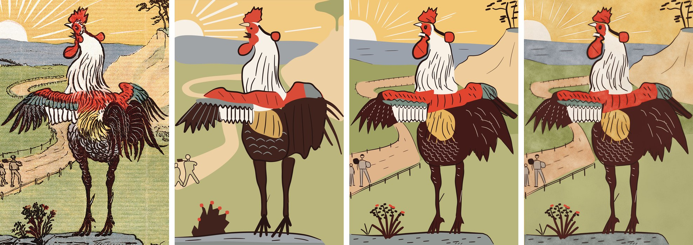
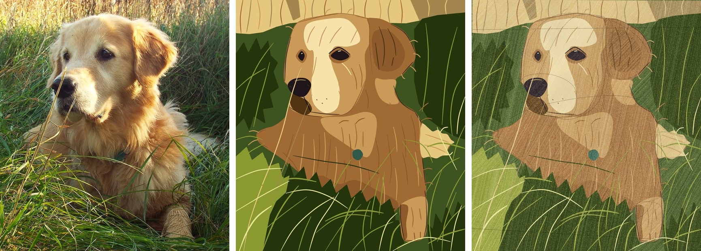
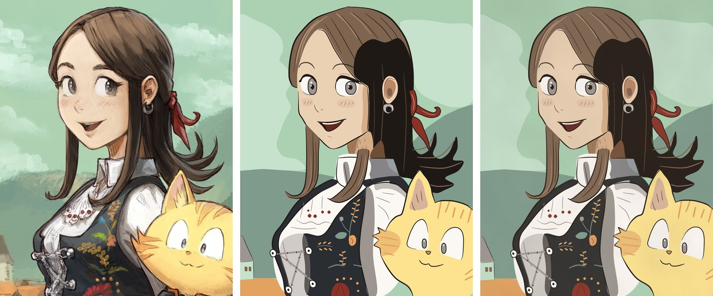
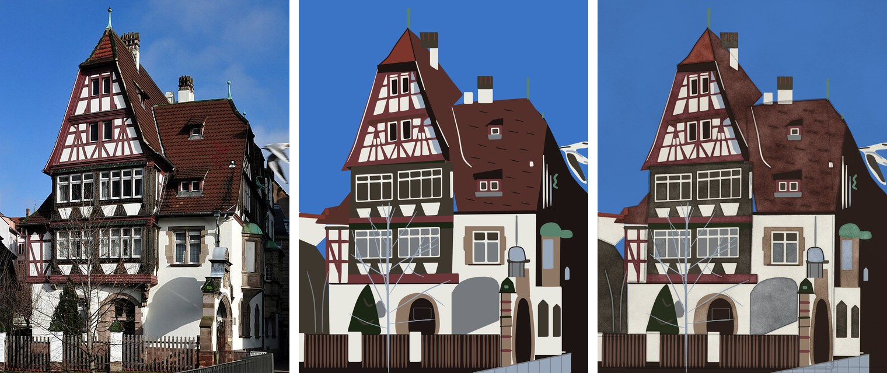
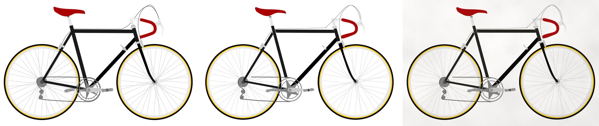
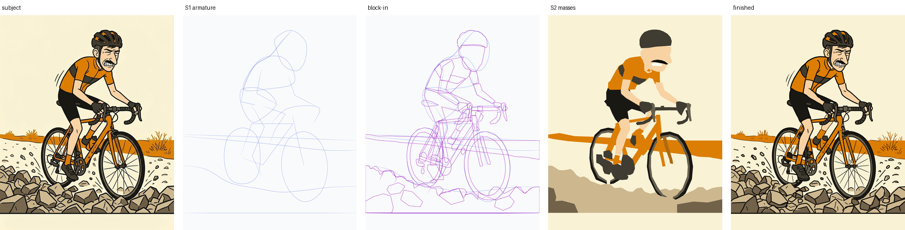
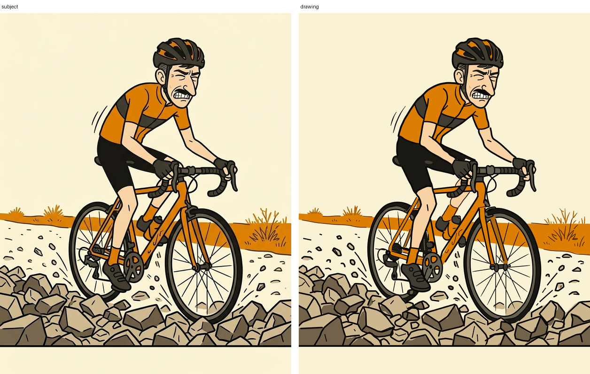
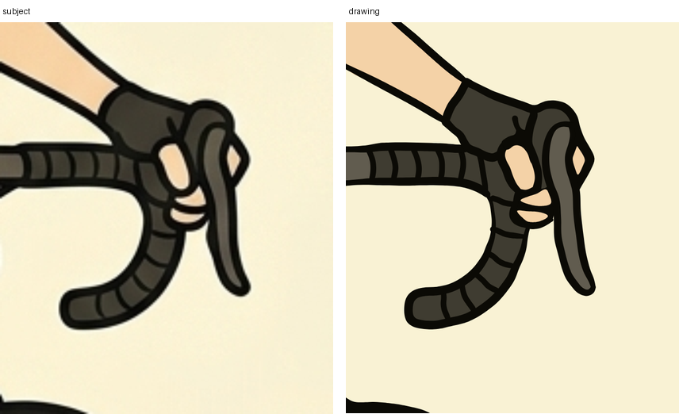

# drawing

A Claude Code skill for drawing a subject by hand. The agent using it places
every mark itself. It reads the subject in writing, blocks it in with straights
it can measure, checks each stage against a render it has to look at, and only
then commits to curve, ink and black. The tools measure the subject and render
what was placed; they never generate a mark. A blind describer (a process shown
the render alone, with no script and no subject) says what the picture shows,
and that answer is the gate on each stage's action. No image model is involved
at any point.

## Gallery



A rooster from a hand-coloured print. Left to right: the subject; the first
drawing, with the shapes right but no hatching and one even outline; the
latest, after the skill learned to measure hatching and line weights
(`--hatch`, `--linework`), to build small figures in full, and never to drop
a named object; and that drawing finished as watercolour and ink on
cold-press paper (`style.json`). Subject: Randolph Caldecott, public domain.



A photograph: the subject, the drawing, and a coloured-pencil sketch finish
with the construction left faint. Colour is sampled from the coat's richest
mid-tones and the head's landmark ratios are measured before drawing.
Subject: David Whelan, CC0.



A portrait from a painted illustration: the subject, the drawing, and the
brush-pen finish. The face's landmarks are measured before any mark, and the
cat entering the frame is drawn, not dropped. Subject: "Pepper and Carrot in
traditional clothing of Bergen" by David Revoy (peppercarrot.com),
[CC BY 4.0](https://creativecommons.org/licenses/by/4.0/); cropped and redrawn.



A photograph of a building: the subject, the drawing, and a watercolour-and-ink
sketch finish with the construction lines left faint. The timber pattern and
the window count are measured and checked. Subject: photo by Ralf Roletschek
(Strasbourg, 2014), [CC BY 3.0](https://creativecommons.org/licenses/by/3.0/);
cropped and redrawn.



A flat vector bicycle with no outline: the subject, the drawing, and the
ink-pen finish on smooth paper. Subject: "Flat design Race Bicycle",
Openclipart, CC0.



One picture through the object stages: subject, armature, block-in, masses, finished.



A scene drawn with one agent per part (head, body, cockpit, bicycle, wheels, rocks), then merged and finished by one more agent.



A part (a hand on the brake hood), drawn and judged at 4x, never at the scale of the whole image.

## How it works

### The object stages

There are eleven stages. Each one narrows a single freedom while the next is
still cheap to fix. A stage may not begin until the previous gate is true on a
render that was actually looked at.

```
0  READ            gate: a shape note per part; the acceptance list
   |                       quotes the describer's own answers
   v  palette.json regions.json parts.json reading.md
1  GESTURE         gate: describe.sh gesture.png answers the action the
   |                       way subject.describe.md does
   v  3-10 loose strokes: line of action, each mass as one loop
2-3 BLOCK-IN        gate: check.py --overlay -- the straights sit on
   |                       the subject's own edges
   v  one region per tier-1/2 part, smooth=False, junctions shared by name
4  CONSTRUCTION     gate: a written turn for every tier-1 volume
   |
   v  volumes turned, centre lines placed
5  MASSES           gate: check.py --masses -- same shape, said in words
   |
   v  one flat per surface, trapped past where the ink will go
6  CONTOUR          gate: check.py --overlay, again, on the curve
   |
   v  the real edge, curved where the subject curves
7-8 INK             gate: check.py --doubled, --joins and --stages pass
   |                       (stages 5-8 interleave per form, far to near)
   v  one stroke per edge, width measured, tagged by the edge it states
9  FILL             gate: rendered with --hide ink, figure still
   |                       separates from ground
   v  flats refined, blacks massed as one value
10 CORRECT          gate: describe.sh drawing.png matches the acceptance
                            list; --registration --parts --ranking
```

### The scene stages

The scene stages wrap the object stages. S0-S2 design the whole picture and
draw no object. After that, either one agent runs every part through the
object stages in place, or the work is split. In a split, one agent does S0-S2
for the whole picture, then one agent per part runs that part's own object
stages in a private copy of the directory, and a final agent merges the copies
and finishes the picture.

```
S0  read as a tone field   one agent: centre of interest, tone plan,
S1  armature                the masses (5-12, no closed contour),
S2  masses / merging        every part vs. its mass, the overlaps table
        |
        |  split.md: one agent per part, depth order, each editing only
        |  its own "# === part: NAME ===" section of draw.py, in a copy
        v
  +-----------+   +-----------+   +-----------+
  |  part A   |   |  part B   |   |  part C   |   S3: object stages
  |  own copy |   |  own copy |   |  own copy |   2-10, each part's own
  |  stages   |   |  stages   |   |  stages   |   correction rounds,
  |  2 .. 10  |   |  2 .. 10  |   |  2 .. 10  |   --zoom before leaving it
  +-----------+   +-----------+   +-----------+
        |               |               |
        +-------+-------+-------+-------+
                v
          MERGE: draw.py section by section, parts.json entry by entry
                v
S4  junctions              one final agent, on the merged picture:
S5  emphasis gradient       walk the overlaps table, confirm the
S6  overlaps                 emphasis decay, spot the blacks, vignette,
S7  blacks / texture         --doubled and --depth clean, no part
S8  correct from a distance   misnamed on its own crop
```

### Data flow

```
source image --4x BILINEAR-->  subject.png (working) + subject_1x.png
     |
     |  trace.py / crop.py      measuring only -- never a mark
     v
palette.json  regions.json  meas/NAME.json
     |
     |  you read positions off these and type the points that carry
     |  the shape
     v
draw.py  --pen.py: stroke(), frame(), write()-->  ops.json
     |
     |  harness/cli.mjs: tldraw, driven headless by Playwright
     v
gesture.png  blockin.png  contour.png  drawing.png
     |
     +--> check.py --masses --overlay --zoom --doubled --depth ...
     +--> describe.sh drawing.png                (blind judge)
     |
     v
corrections, named by stage  -->  back into draw.py (stage="correct")
```

### The authorship rule

The tools measure, and only `draw.py` draws. A measuring tool may report where
things are: a landmark, a width, the rows a slot occupies, a traced contour to
read positions off. It may not emit the point list, and nothing may turn a
trace into strokes on your behalf. That rules out a generated section module,
a loop over regions, and a generator whose output is imported or pasted into
`draw.py`.

`pen.write` refuses to save the drawing, and `check.py --stages` fails it, on:

- ink with no gesture, block-in and contour stage behind it (the stages must
  exist; neither check requires a contour under every ink mark)
- a stroke called from outside `draw.py`, or a call site reached more than
  once (a loop, a comprehension, an import that draws)
- control points that are mostly not written as literal numbers in `draw.py`

Reading a traced outline and typing the points where the silhouette turns, in
perimeter order, is drawing. Emitting that same walk automatically, one point
per row, is not. Generated output pasted into `draw.py` as literal numbers
passes both checks and is still forbidden: the rule forbids it, whether or not
a tool detects it.

## The checks

`check.py` gates a render. Each flag produces a list to work through, not a
score.

| group | flag | catches |
|---|---|---|
| shape/placement | `--masses` | the wrong shape at thumbnail size; a design gate, not a proportion gate |
| | `--scan x,y,w,h --side S` | a coordinate or a proportion off by row, subject beside drawing |
| | `--overlay [--box]` | the two inks blended together; the only view of interior lines |
| | `--zoom x,y,w,h` | whether the marks are any good at 4x; the primary gate on any object |
| | `--weights rows` | the line hierarchy against the subject's, as width@centre |
| | `--hatch x,y,w,h [--ref]` | the hatching in a box: coverage, and each group's angle, spacing, length and width; numbers, never strokes |
| | `--linework parts.json` | a measured hatch group missing from the drawing, or a weight span under half the subject's |
| | `--registration` | colour and line disagreeing |
| | `--unfilled --paper C` | bare paper where the subject carries the object, and a flat painted where the subject is bare |
| | `--faces ops.json --regions R` | a flat simpler than the traced region under it |
| depth/order | `--doubled ops.json` | one edge stated twice on the page |
| | `--joins ops.json [--parts parts.json]` | a line stopping one to eight line widths short of the mark it runs at (a chain short of its sprocket, a ring left open); `_gaps` in parts.json excuses a pair |
| | `--depth ops.json parts.json` | write order that does not deliver the inventory's `in_front`; UNRESOLVED where tags and inventory disagree |
| counts/inventory | `--parts parts.json` | a part absent, or drifted out of its box |
| | `--checklist parts.json` | a sub-form a reference's checklist names, missing with no `_absent` reason; blocks `build.sh` |
| | `--counts parts.json` | a repeated form culled, merged or added against the subject's own count |
| | `--ranking parts.json` | a part outranking its tier, or two forms merged into one value |
| authorship | `--stages ops.json` | a stage that does not exist, or a mark the script did not write |

## Install

As a Claude Code plugin:

```
/plugin marketplace add jchapuis/drawing-skill
/plugin install drawing@drawing-skill
```

Or clone it straight into the skills directory:

```bash
git clone https://github.com/jchapuis/drawing-skill ~/.claude/skills/drawing
```

Then, once, set up the rendering harness:

```bash
cd ~/.claude/skills/drawing/harness && npm install && npm run build && npx playwright install chromium
```

Python needs `numpy`, `scipy`, `pillow` and `opencv-python`. `describe.sh`
needs the `claude` CLI on PATH. A drawing lives in its own directory holding
`subject.png`. Copy `build.sh` in beside it and point it at the skill with
`export SKILL=~/.claude/skills/drawing` (or edit the `SKILL=` line directly).
A copied `build.sh` cannot find the skill on its own, and says so. Copy
`gates.sh` the same way to run every gate at once.

## Cost

This buys fidelity, not speed. A single part carried through all the stages
costs roughly 0.35-0.45M tokens. A scene split into one agent per part costs
roughly 3M tokens across about eight agents. A scene with many recognisable
parts is expensive, so budget for it.

## Extension points

- **A new subject class.** Add `reference/<topic>.md` and load it from
  `SKILL.md`'s Reference section where relevant. Give it a fenced code
  block tagged `checklist`, naming the object and its sub-forms
  (`object: bike|bicycle` / `sub-forms: tyre|tire rim spoke hub ...`).
  `check.py --checklist` enforces it, and `build.sh` blocks the build on a
  missing sub-form with no `_absent` reason.
- **A new gate.** Add a function and a flag in `check.py`, and a test in
  `test_tools.py` or `test_depth.py`. Every gate is tested in both
  directions: it has to pass a known-good case and fail a known-bad one, not
  just run clean once.
- **A new instrument.** Add a `tool` to `INSTRUMENTS` in `pen.py` (alongside
  `brush`, `pen`, `marker`, `crayon`, `flat`, `gouache`) or a nib in the
  weight swatch (`gauge()`). The palette itself is fixed at 13 stock names
  (`black grey light-violet violet blue light-blue yellow orange green
  light-green light-red red white`, plus `background` for the ground), and
  the harness repoints those names to real colours with `--palette`.
- **The describer.** `describe.sh`'s five fixed questions are inline in the
  script's `PROMPT`; change them there.
- **The canvas.** `harness/` is a tldraw document driven headless by
  Playwright through `cli.mjs`. The same document on disk opens in tldraw
  afterwards for a person to edit by hand.
- **The split.** The section markers (`# === part: NAME ===` /
  `# === mass: NAME ===` / `# === end: NAME ===`) and the shape of `split.md`
  are set out in `reference/scene.md` under "Splitting a scene across agents".

## Layout

```
SKILL.md         object stages + scene stages: what each stage produces,
                    and the check that gates it
reference/        method.md (the full method), scene.md (the scene
                    level: tone plan, massing, the split); the rest
                    loaded per subject (head, figure, hands-and-feet,
                    quadruped, bird, bicycle, vehicle, building,
                    landscape, tree-and-plant, still-life) or craft
                    (measuring, line, colour, tone, light, correcting,
                    redrawing, photograph)
pen.py            stroke()/frame()/write(): the hand, plus the
                    authorship audit write() runs before saving
trace.py          measures a flat-cel subject's regions once; never
                    writes a mark
crop.py           one object's measuring crop at 1:1, corner of the
                    whole image stored in the PNG
describe.sh       the blind describer: five fixed questions, no script
check.py          the gates -- masses, overlay, scan, zoom, weights,
                    doubled, joins, depth, checklist, counts, ranking, stages,
                    registration, unfilled, faces
finish.py         turns drawing.png into final.png: medium, paper,
                    sketch construction, scan look (style.json)
build.sh          runs draw.py, audits the stages, renders every stage
gates.sh          runs every gate that applies, one verdict line each
harness/          the tldraw canvas, driven from the command line
docs/             the images in this README
test_*.py         gates checked against known-good and known-bad cases
.claude-plugin/   marketplace.json + plugin.json, for /plugin install
```

## Licence

MIT, see [LICENSE](LICENSE).
